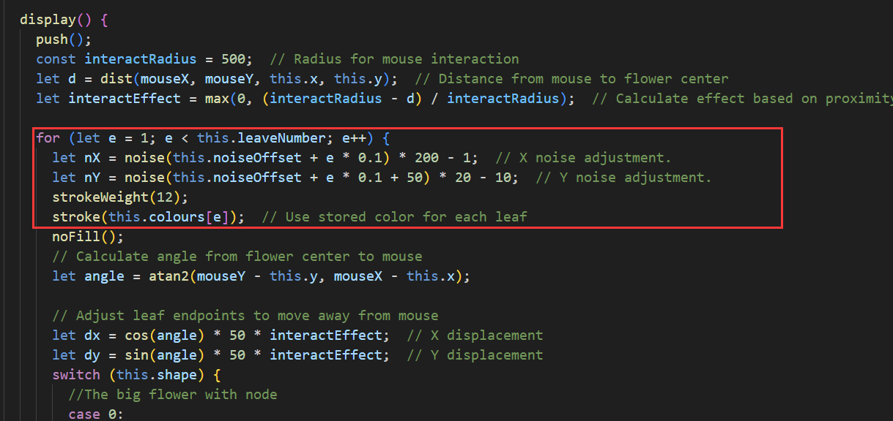
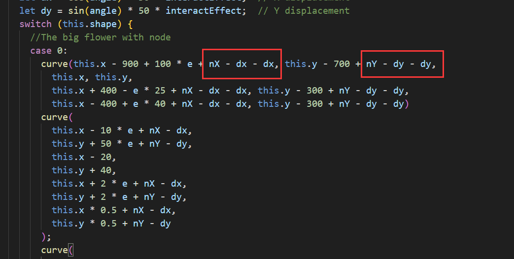
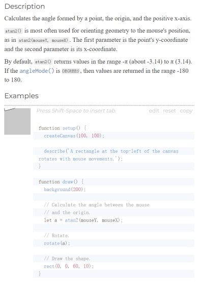
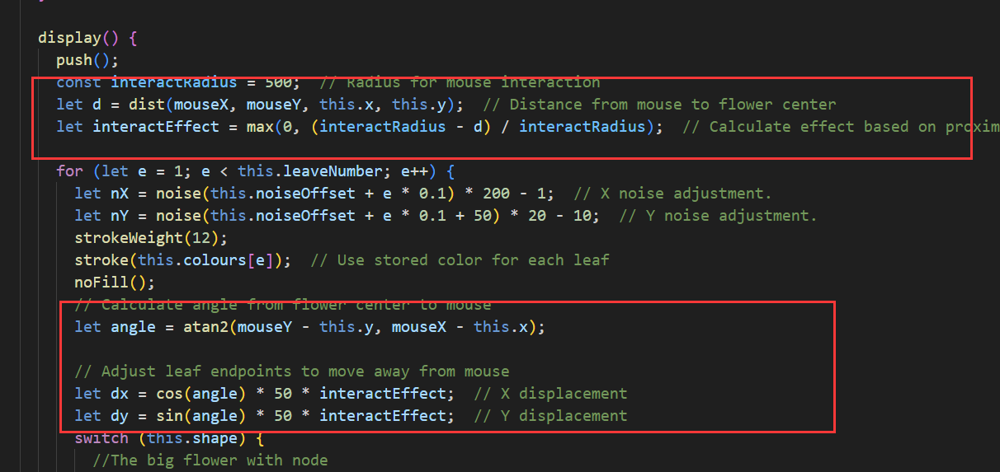
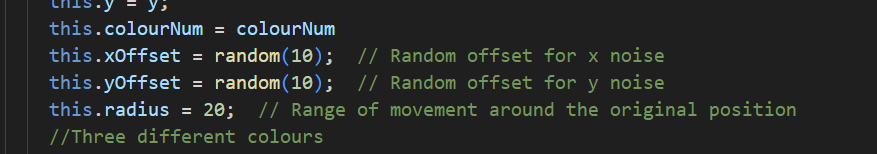

# jliu0024_Functioning_Prototype

The noise animation is started when the file is loaded. The flowers and dots in the animation will randomly wiggle in their respective positions, creating a visual effect of floating in space. Additionally, I've added an interactive feature where the mouse interacts with the perlin noise. Although the user cannot see the exact position of the mouse, they can move the mouse to toggle the flowers and dots randomly, thus enabling an intuitive interaction with the artwork. This design aims to enhance user engagement and immersion.

For this project, I chose to use Perlin noise to drive the animation effects. Although I included some user input interaction elements about the mouse, this was mainly to show the nuances of the Perlin noise changes rather than to focus on the mouse itself. At the same time, the animation of the group member who chose user input as their subject matter did not swing as much as the Perlin noise, and this design ensured that there was differentiation between our work. The different classes were effectively defined at the group stage of the project, so animating the flowers and dots at the individual stage was relatively simple. In order to demonstrate my animation effectively, I plan to submit a 10-second gif that demonstrates the Perlin noise-driven fluttering of the flowers and dots, as well as the interaction of the mouse swipe.

In the flower class, I first declared the initial noise offset and then added the X and Y direction parameters of the noise in the display method to control the variation of the noise. In addition, I used the atan2() function(Reference | p5.js, n.d.) to calculate the angle between the points (x, y) from the positive direction of the x-axis. This function automatically handles the calculation of the angle in different quadrants and ensures the accuracy of the angle value. This angle value is then used to dynamically adjust the x and y positions of the various parts of the flower, where interactEffect is an adjustment factor that controls how much the petals move. In this method, the parts of the flower dynamically move away from the mouse according to the position of the mouse cursor, enhancing the user interaction experience and making the animation more attractive.

Based on the original code file, I added the nX and nY variables, which are used to adjust the position of the petal in the horizontal X direction and vertical Y direction, respectively. In addition, I used the trigonometric functions cos() and sin() to calculate dx and dy. The purpose of these two variables is to enable the petals to dynamically avoid the mouse as it approaches. This design ensures that the petals move in the same direction as the mouse pointer relative to the centre of the flower. This interaction not only increases the dynamism of the visual effect, but also improves the user interaction experience.

I use the max function(GeeksforGeeks, 2023b) to make sure that even if the mouse goes outside the set interaction radius (when d is larger than interactRadius, resulting in a negative scale), the interactEffect remains at 0. This is because, logically, once the mouse has gone outside the interaction radius, the flower shouldn't have any interaction effect. max serves as a limiting factor to make sure the interactEffect will not go below 0. 

For the dot class in the background, I made some modifications similar to flower, but used the random() function to determine the initial offset of each point in the X and Y directions, which is chosen randomly between 0 and 10. I also defined the radius variable, which specifies the maximum distance the point can be moved from its initial position. This setting makes the dynamics of the background points distinctly different from the pattern of action of the petal elements, adds visual hierarchy, and makes the whole animation look more lively and interesting.

**Reference list:**  
GeeksforGeeks. (2023a, August 23). p5.js max() function. GeeksforGeeks. https://www.geeksforgeeks.org/p5-js-max-function/
reference | p5.js. (n.d.). https://p5js.org/reference/#/p5/atan2
The University of Sydney. (n.d.). Week 8 Lecture. https://canvas.sydney.edu.au/courses/56592/pages/week-8-lecture-2?module_item_id=2258230